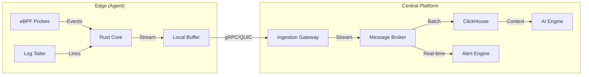

# AncientReport Version 2: The Autonomous Observability Platform

## Executive Summary

AncientReport V1 established a solid foundation for AI-driven infrastructure monitoring using Rust, Python, and ClickHouse. Version 2 (V2) aims to transform this into a **real-time, autonomous observability platform** that not only reports on the past but actively monitors the present and predicts the future with millisecond precision.

The core shift in V2 is from **Polling (60s)** to **Streaming (Real-time)** and from **System Metrics (/proc)** to **Deep Observability (eBPF)**.

---

## 1. Architecture Evolution

### Current (V1)
- **Agent**: Polls `/proc` every 60s.
- **Transport**: Direct HTTP POST to ClickHouse/API.
- **Analysis**: Scheduled cron jobs (Hourly/Daily).
- **Latency**: Data is up to 60s old.

### Proposed (V2)
- **Agent**: Event-driven eBPF probes + 1s metric resolution.
- **Transport**: Streaming Data Pipeline (NATS JetStream / Redpanda).
- **Analysis**: Real-time Stream Processing + On-demand AI.
- **Latency**: Sub-second visibility.

---

## 2. Key Feature Pillars

### A. Deep Observability with eBPF (The "X-Ray" Vision)
*Replace the placeholder `EbpfCollector` with actual implementation.*
- **Network Flows**: Zero-overhead traffic monitoring. Map service-to-service communication automatically.
- **TCP Analysis**: Measure retransmissions, RTT, and connection drops without application instrumentation.
- **Application Profiling**: Continuous CPU profiling (flamegraphs) to see exactly which function is consuming CPU.
- **Security Monitoring**: Detect unexpected shell executions or file modifications.

### B. Unified Logs & Metrics
*Metrics tell you "What", Logs tell you "Why".*
- **Log Collection**: Integrate a high-performance log collector (like Vector/Promtail logic) into the Rust agent.
- **Correlation**: Automatically correlate a CPU spike with the error logs that occurred at the exact same millisecond.
- **AI Log Analysis**: Use the AI Engine to parse unstructured logs and find "unknown unknowns".

### C. Real-Time Alerting & Stream Processing
- **Instant Alerts**: Don't wait for the hourly report. If disk latency > 100ms for 5s, alert immediately.
- **Dynamic Thresholds**: Use online algorithms (e.g., T-Digest) to detect anomalies in real-time streams.

### D. Centralized Fleet Management
- **Remote Config**: Push configuration updates (sampling rates, alert rules) to 1000s of agents instantly.
- **Auto-Discovery**: Agent automatically detects running services (Postgres, Redis, Kafka) and applies the correct monitoring profile.
- **Self-Healing**: Agent can restart failed services or clear cache based on pre-defined playbooks (optional/safe mode).

### E. Interactive AI Operations (ChatOps)
- **"Talk to your Infrastructure"**: A chat interface in the UI where users can ask:
    - *"Why did the web server slow down at 2 PM?"*
    - *"Show me the top 5 SQL queries by latency."*
- **Root Cause Analysis**: One-click "Analyze This" button on any chart spike that triggers an immediate AI investigation.

---

## 3. Technology Stack Upgrades

| Component | V1 Technology | V2 Recommendation | Why? |
|-----------|---------------|-------------------|------|
| **Agent** | Rust + `/proc` | Rust + `libbpf-rs` + `aya` | Kernel-level visibility, <1% overhead. |
| **Transport**| HTTP POST | gRPC + NATS JetStream | Reliability, backpressure, streaming. |
| **Database** | ClickHouse | ClickHouse + Materialized Views | Real-time aggregation at write time. |
| **Backend** | FastAPI (Python) | Rust (API) + Python (AI Workers) | Rust for high-concurrency API, Python for LLM logic. |
| **Frontend** | React + Recharts | React + WebGL/WASM | Handle 1000s of data points smoothly. |

---

## 4. Implementation Roadmap

### Phase 1: The Foundation (Weeks 1-4)
- [ ] **eBPF Core**: Implement `network` and `disk` probes in the Rust agent.
- [ ] **Streaming Layer**: Deploy NATS JetStream and update Agent to stream data.
- [ ] **Real-time UI**: Update React App to use WebSockets for live charts.

### Phase 2: Intelligence (Weeks 5-8)
- [ ] **Log Integration**: Add log collection to Agent and ClickHouse.
- [ ] **Alerting Engine**: Build a stream processor for real-time alerts.
- [ ] **Auto-Discovery**: Implement service detection logic.

### Phase 3: Experience (Weeks 9-12)
- [ ] **Topology Map**: Visualize service dependencies using eBPF data.
- [ ] **Chat Interface**: Build the AI ChatOps interface.
- [ ] **Fleet Management**: Build the centralized config dashboard.

---

## 5. Immediate Next Steps
1.  **Activate eBPF**: The code is currently commented out. We need to compile the BPF programs and load them.
2.  **Refactor Agent**: Split the monolithic loop into an async actor system for better concurrency.
3.  **Deploy Message Broker**: Set up a simple NATS instance to decouple Agent from ClickHouse.
