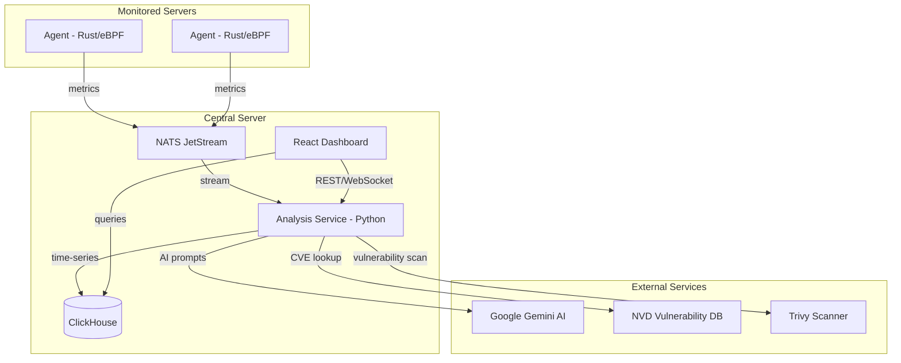
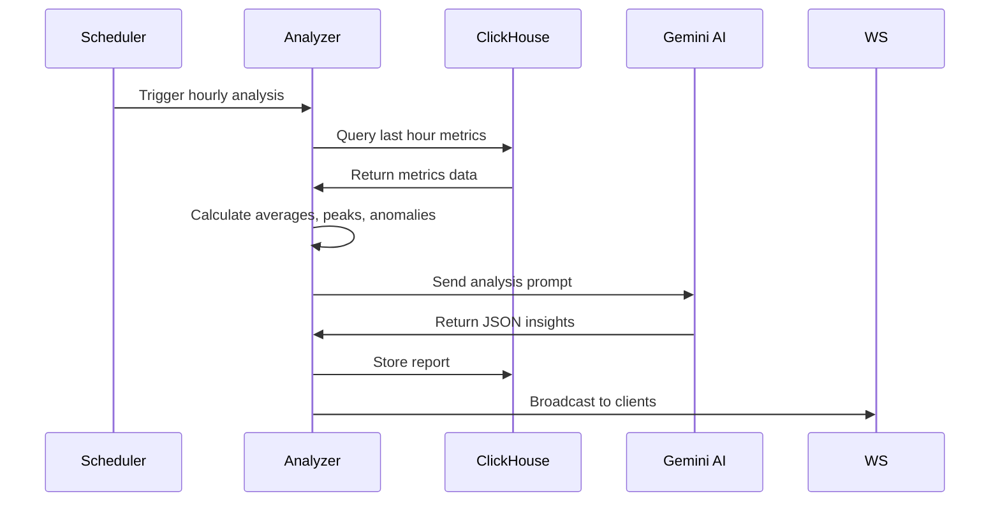
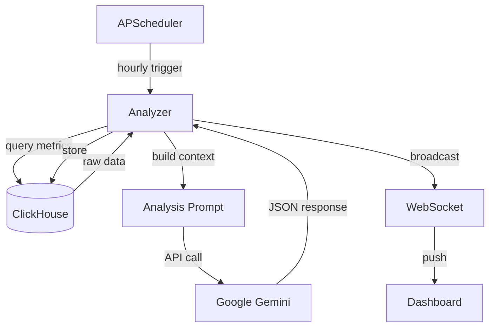
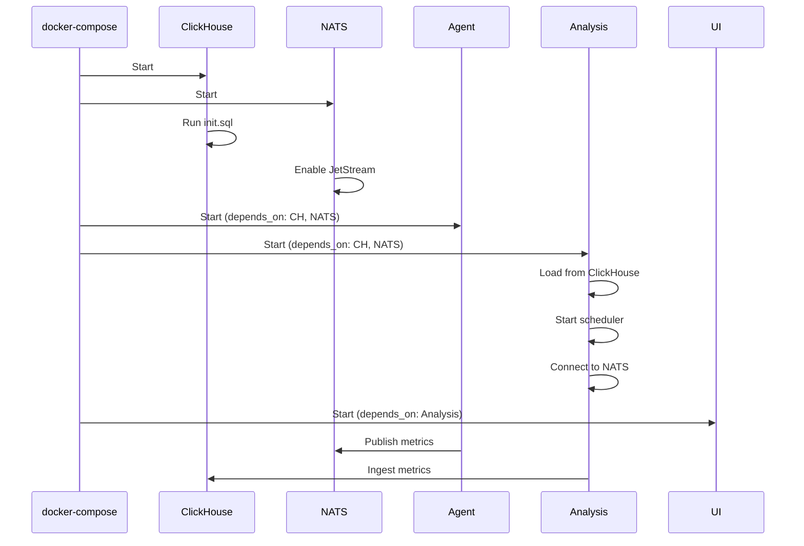

# AncientReport Technical Documentation

> **AI-Powered Infrastructure Monitoring & Analysis Platform**
> Version 3.0.0 | Last Updated: December 2024

---

## 📋 Table of Contents

1. [System Overview](#system-overview)
2. [Architecture](#architecture)
3. [Core Components](#core-components)
4. [Data Flow](#data-flow)
5. [Database Schema](#database-schema)
6. [API Reference](#api-reference)
7. [UI Components](#ui-components)
8. [Deployment](#deployment)

---

## 🌐 System Overview

AncientReport is an enterprise-grade infrastructure monitoring platform that combines:

- **Real-time metric collection** via eBPF-enabled agents
- **AI-powered analysis** using Google Gemini for insights
- **Distributed multi-server monitoring** with per-server filtering
- **Security vulnerability scanning** with Trivy integration
- **Auto-remediation capabilities** for container management
- **Modern React dashboard** with real-time WebSocket updates

### Key Features

| Feature | Description |
|---------|-------------|
| **eBPF Monitoring** | Kernel-level network and process tracing |
| **AI Analysis** | Hourly/daily reports with Gemini-powered insights |
| **Security Scanning** | Container vulnerability scanning with Trivy + NVD API |
| **Custom Monitors** | Port, HTTP, process, and script monitoring |
| **Container Topology** | Real-time Docker container relationship mapping |
| **Auto-Remediation** | One-click container restart/scale/cleanup actions |
| **Multi-Server** | Centralized monitoring of distributed infrastructure |

---

## 🏗 Architecture



### Network Ports

| Service | Port | Description |
|---------|------|-------------|
| UI | 6080 | React Dashboard |
| Analysis API | 6800 | REST + WebSocket API |
| ClickHouse HTTP | 6123 | Database HTTP interface |
| ClickHouse Native | 6001 | Database native protocol |
| NATS | 4222 | Message queue |
| NATS Monitoring | 8222 | NATS monitoring/metrics |

---

## ⚙️ Core Components

### 1. Agent (Rust + eBPF)

**Location:** `agent/`

The agent is a high-performance Rust application that collects metrics from the host system.

#### Module Structure

```
agent/src/
├── main.rs              # Entry point, orchestration
├── config.rs            # Configuration management
├── aggregator.rs        # Metric aggregation (1-minute buckets)
├── streaming.rs         # NATS JetStream publisher
├── storage.rs           # Direct ClickHouse writes
├── collectors/
│   ├── proc.rs          # /proc filesystem collector
│   ├── docker.rs        # Docker container stats
│   └── ebpf.rs          # eBPF-based collection
├── custom_monitors/
│   ├── port.rs          # TCP port monitoring
│   ├── http.rs          # HTTP endpoint monitoring
│   └── process.rs       # Process monitoring
├── security/
│   └── port_scanner.rs  # Security port scanning
└── ebpf/
    ├── network.bpf.c    # Network traffic tracing
    ├── process_flow.bpf.c
    ├── syscall_monitor.bpf.c
    └── tcp_tracker.bpf.c
```

#### Collected Metrics

| Metric | Source | Description |
|--------|--------|-------------|
| `cpu_usage_percent` | /proc/stat | System-wide CPU usage |
| `cpu_cores` | /proc/cpuinfo | Number of CPU cores |
| `memory_usage_percent` | /proc/meminfo | Memory utilization |
| `memory_used_mb` | /proc/meminfo | Used memory in MB |
| `memory_total_mb` | /proc/meminfo | Total memory |
| `load_avg_1/5/15min` | /proc/loadavg | System load averages |
| `process_count` | /proc | Running process count |
| `disk_read_bytes` | /proc/diskstats | Disk I/O read |
| `disk_write_bytes` | /proc/diskstats | Disk I/O write |
| `disk_total_gb` | statvfs | Total disk space |
| `disk_used_gb` | statvfs | Used disk space |
| `network_bytes_sent` | /proc/net/dev | Network TX |
| `network_bytes_received` | /proc/net/dev | Network RX |
| `network_drops` | /proc/net/dev | Dropped packets |
| `process_cpu_usage` | /proc/[pid]/stat | Per-process CPU |
| `process_memory_mb` | /proc/[pid]/statm | Per-process memory |
| `process_disk_io_mb` | /proc/[pid]/io | Per-process disk I/O |

#### Data Publishing

The agent publishes metrics to NATS JetStream on subject `metrics.raw`:

```json
{
  "hostname": "xcr9",
  "timestamp": 1701856800,
  "metric_name": "cpu_usage_percent",
  "value": 45.2,
  "tags": {
    "core": "0"
  }
}
```

---

### 2. Analysis Service (Python/FastAPI)

**Location:** `analysis/`

The Analysis service is the brain of the system, providing:
- REST API endpoints
- Real-time WebSocket connections
- AI-powered analysis
- Scheduled jobs
- Security scanning

#### Module Structure

```
analysis/src/
├── main.py              # FastAPI app, scheduler, startup
├── ingestion_gateway.py # NATS → ClickHouse bridge
├── ai/
│   └── engine.py        # Multi-provider AI (Gemini/OpenAI/Claude)
├── analyzers/
│   ├── hourly.py        # Hourly analysis logic
│   └── daily.py         # Daily analysis logic
├── storage/
│   ├── clickhouse_client.py
│   ├── bucket_manager.py
│   └── settings_manager.py
├── api/
│   ├── containers.py    # Docker container API
│   ├── healthchecks.py  # Container health checks
│   ├── custom_monitors.py # Custom monitoring
│   ├── security_scanning.py # Trivy + NVD integration
│   ├── auto_remediation.py # Container remediation
│   ├── topology.py      # Container topology mapping
│   ├── alerts.py        # Alert management
│   ├── ai_chat.py       # AI chat interface
│   ├── realtime.py      # WebSocket endpoints
│   ├── settings.py      # Application settings
│   └── ebpf_data.py     # eBPF metrics API
└── utils/
    └── timezone.py      # Tehran timezone handling
```

#### Scheduled Jobs

| Job | Schedule | Description |
|-----|----------|-------------|
| Hourly Analysis | Every hour at :00 | Full system analysis with AI insights |
| Daily Analysis | 23:55 daily | Daily summary and trends |
| Bucket Cleanup | Every hour at :30 | Clean old data files |
| Data Retention | 03:00 daily | Delete data older than 3 days |
| Security Scan | 02:00 daily | Full vulnerability scan |

#### AI Analysis Pipeline



---

### 3. Ingestion Gateway

**Location:** `analysis/src/ingestion_gateway.py`

Bridges NATS JetStream to ClickHouse with batched writes.

#### Flow

```
NATS JetStream (metrics.raw)
         ↓
    Pull Consumer (durable: "analysis_consumer")
         ↓
    Message Buffer (batch_size: 100)
         ↓
    ClickHouse Bulk Insert
         ↓
    WebSocket Broadcast (real-time)
```

#### Configuration

| Parameter | Value | Description |
|-----------|-------|-------------|
| `batch_size` | 100 | Messages per batch |
| `batch_timeout` | 2s | Max wait time for batch |
| `consumer_name` | analysis_consumer | Durable consumer name |

---

### 4. UI Dashboard (React/TypeScript)

**Location:** `ui/`

Modern React dashboard built with:
- **Vite** for fast development
- **TailwindCSS** for styling
- **Framer Motion** for animations
- **Recharts** for data visualization
- **WebSocket** for real-time updates

#### Component Structure

```
ui/src/
├── App.tsx              # Main dashboard layout
├── main.tsx             # Entry point
├── index.css            # Global styles (glassmorphism, neon)
├── components/
│   ├── ServerSelector.tsx    # Multi-server dropdown
│   ├── ServerInfoCard.tsx    # Hardware info display
│   ├── MetricsChart.tsx      # Time-series charts
│   ├── LiveChart.tsx         # Real-time WebSocket chart
│   ├── CPUChart.tsx          # CPU usage chart
│   ├── MemoryChart.tsx       # Memory usage chart
│   ├── DiskIOChart.tsx       # Disk I/O chart
│   ├── NetworkChart.tsx      # Network traffic chart
│   ├── DockerContainers.tsx  # Container list
│   ├── ContainerTopology.tsx # Topology visualization
│   ├── SecurityDashboard.tsx # Security scanning UI
│   ├── CustomMonitors.tsx    # Monitor configuration
│   ├── MonitorResultsWidget.tsx # Monitor status
│   ├── RemediationCenter.tsx # Auto-remediation UI
│   ├── AlertCenter.tsx       # Alert management
│   ├── AIChat.tsx            # AI assistant
│   ├── SettingsModal.tsx     # Application settings
│   └── ui/
│       ├── StatCard.tsx      # Stat display cards
│       └── Badge.tsx         # Status badges
├── hooks/
│   ├── useMetrics.ts         # Metrics data hook
│   └── useSettings.ts        # Settings hook
└── stores/
    └── settingsStore.ts      # Zustand state
```

#### Key Features

| Component | Features |
|-----------|----------|
| **Dashboard** | Health score, recommendations, anomalies |
| **Charts** | Real-time updates, 1h/6h/24h ranges |
| **Containers** | Status, resource usage, health checks |
| **Topology** | Interactive graph, connection mapping |
| **Security** | Vulnerability list, scan history, severity |
| **Remediation** | One-click actions, approval workflow |

---

## 🔄 Data Flow

### Metric Collection Flow

```mermaid
flowchart LR
    subgraph Host
        Proc[/proc filesystem]
        Docker[Docker API]
        eBPF[eBPF probes]
    end
    
    subgraph Agent
        Collectors[Collectors]
        Aggregator[Aggregator]
        Pub[NATS Publisher]
    end
    
    subgraph Central
        JetStream[NATS JetStream]
        Gateway[Ingestion Gateway]
        CH[(ClickHouse)]
        WS[WebSocket]
    end
    
    Proc --> Collectors
    Docker --> Collectors
    eBPF --> Collectors
    Collectors --> Aggregator
    Aggregator -->|1 min buckets| Pub
    Pub --> JetStream
    JetStream --> Gateway
    Gateway -->|batch insert| CH
    Gateway -->|real-time| WS
```

### Analysis Flow



---

## 🗄 Database Schema

### Core Tables

#### `metrics` - Time-series metrics
```sql
CREATE TABLE metrics (
    timestamp DateTime,
    hostname String,
    metric_type String,
    metric_name String,
    value Float64,
    tags Map(String, String)
) ENGINE = MergeTree()
PARTITION BY toYYYYMM(timestamp)
ORDER BY (hostname, metric_type, timestamp)
TTL timestamp + INTERVAL 90 DAY;
```

#### `hourly_reports` - AI analysis reports
```sql
CREATE TABLE hourly_reports (
    report_id String,
    timestamp DateTime,
    hostname String,
    system_health UInt8,
    metrics String,        -- JSON
    ai_insights String,    -- JSON
    recommendations String, -- JSON
    capacity_forecast String -- JSON
) ENGINE = MergeTree()
ORDER BY (hostname, timestamp)
TTL timestamp + INTERVAL 1 YEAR;
```

#### `docker_containers` - Container stats
```sql
CREATE TABLE docker_containers (
    timestamp DateTime,
    container_id String,
    container_name String,
    image String,
    status String,
    cpu_percent Float64,
    memory_usage UInt64,
    memory_limit UInt64,
    memory_percent Float64,
    network_rx_bytes UInt64,
    network_tx_bytes UInt64,
    block_read_bytes UInt64,
    block_write_bytes UInt64,
    uptime_seconds UInt64,
    restart_count UInt32,
    created_at DateTime
) ENGINE = MergeTree()
ORDER BY (timestamp, container_id)
TTL timestamp + INTERVAL 30 DAY;
```

### V3 Feature Tables

#### `custom_monitors` - Monitor configuration
```sql
CREATE TABLE custom_monitors (
    id UUID DEFAULT generateUUIDv4(),
    name String,
    type Enum8('port'=1, 'http'=2, 'process'=3, 'script'=4, 'metric'=5),
    config String,  -- JSON
    interval_seconds UInt32 DEFAULT 60,
    enabled Bool DEFAULT true,
    created_at DateTime DEFAULT now(),
    updated_at DateTime DEFAULT now()
) ENGINE = ReplacingMergeTree(updated_at)
ORDER BY (name, id);
```

#### `security_scan_results` - Vulnerability scans
```sql
CREATE TABLE security_scan_results (
    id String,
    target String,
    scan_type String,
    status String,
    started_at String,
    completed_at Nullable(String),
    vulnerabilities String,  -- JSON array
    score UInt8,
    error String DEFAULT ''
) ENGINE = ReplacingMergeTree()
ORDER BY (id, started_at);
```

#### `alert_rules` - Alerting configuration
```sql
CREATE TABLE alert_rules (
    id UUID DEFAULT generateUUIDv4(),
    name String,
    condition String,  -- DSL expression
    severity Enum8('info'=1, 'warning'=2, 'critical'=3),
    channels Array(String),
    cooldown_minutes UInt16 DEFAULT 15,
    enabled Bool DEFAULT true,
    created_at DateTime DEFAULT now(),
    updated_at DateTime DEFAULT now()
) ENGINE = ReplacingMergeTree(updated_at)
ORDER BY (name, id);
```

---

## 📡 API Reference

### Base URL
```
http://<server>:6800
```

### Core Endpoints

| Method | Endpoint | Description |
|--------|----------|-------------|
| GET | `/` | Health check |
| GET | `/api/servers` | List active servers |
| GET | `/api/servers/info` | Get hardware info for all servers |
| GET | `/api/reports/latest` | Get latest analysis report |
| POST | `/api/analysis/trigger/hourly` | Trigger hourly analysis |

### Metrics Endpoints

| Method | Endpoint | Description |
|--------|----------|-------------|
| GET | `/api/metrics/cpu` | CPU metrics for charting |
| GET | `/api/metrics/memory` | Memory metrics |
| GET | `/api/metrics/disk` | Disk I/O metrics |
| GET | `/api/metrics/network` | Network metrics |

### Custom Monitors API (`/api/v3/monitors`)

| Method | Endpoint | Description |
|--------|----------|-------------|
| GET | `/` | List all monitors |
| POST | `/` | Create monitor |
| GET | `/{id}` | Get monitor details |
| PUT | `/{id}` | Update monitor |
| DELETE | `/{id}` | Delete monitor |
| POST | `/{id}/toggle` | Toggle enabled state |
| GET | `/{id}/results` | Get monitor results |

### Security Scanning API (`/api/v3/security/scanning`)

| Method | Endpoint | Description |
|--------|----------|-------------|
| GET | `/health` | Scanner health status |
| GET | `/results` | Recent scan results |
| GET | `/stats` | Security statistics |
| POST | `/trigger` | Scan specific target |
| POST | `/trigger-all` | Scan all containers |
| GET | `/schedule` | Get scheduled scan info |

### Auto-Remediation API (`/api/v3/remediation`)

| Method | Endpoint | Description |
|--------|----------|-------------|
| GET | `/actions` | Available actions |
| GET | `/status` | System status |
| POST | `/trigger` | Trigger action |
| POST | `/approve/{id}` | Approve pending job |
| POST | `/reject/{id}` | Reject pending job |
| GET | `/jobs` | List recent jobs |

### Container Topology API (`/api/v3/topology`)

| Method | Endpoint | Description |
|--------|----------|-------------|
| GET | `/map` | Full topology map |
| GET | `/container/{id}` | Container details |
| GET | `/problems` | Detected problems |
| GET | `/stats` | Topology statistics |
| POST | `/refresh` | Force cache refresh |

### WebSocket Endpoints

| Endpoint | Description |
|----------|-------------|
| `/ws/metrics` | Real-time metrics stream |

---

## 🖥 UI Components

### Dashboard Layout

```
┌─────────────────────────────────────────────────────────────────┐
│ [Logo]  AncientReport             [Server Selector] [Settings]  │
├─────────────────────────────────────────────────────────────────┤
│ ┌──────────────┐ ┌──────────────┐ ┌──────────────┐              │
│ │ Health       │ │ CPU          │ │ Memory       │ Server Info  │
│ │ Score: 85    │ │ 45%          │ │ 62%          │ Card         │
│ └──────────────┘ └──────────────┘ └──────────────┘              │
├─────────────────────────────────────────────────────────────────┤
│                           Charts                                 │
│  ┌─────────────────────┐  ┌─────────────────────┐               │
│  │ CPU Usage           │  │ Memory Usage        │               │
│  │ [Line Chart]        │  │ [Line Chart]        │               │
│  └─────────────────────┘  └─────────────────────┘               │
│  ┌─────────────────────┐  ┌─────────────────────┐               │
│  │ Disk I/O            │  │ Network Traffic     │               │
│  │ [Stacked Area]      │  │ [Line Chart]        │               │
│  └─────────────────────┘  └─────────────────────┘               │
├─────────────────────────────────────────────────────────────────┤
│ ┌────────────────┐ ┌────────────────┐ ┌────────────────┐        │
│ │ AI Analysis    │ │ Recommendations│ │ Anomalies      │        │
│ │ [Summary]      │ │ [List]         │ │ [List]         │        │
│ └────────────────┘ └────────────────┘ └────────────────┘        │
├─────────────────────────────────────────────────────────────────┤
│ ┌────────────────┐ ┌────────────────┐ ┌────────────────┐        │
│ │ Containers     │ │ Custom Monitors│ │ Security       │        │
│ │ [Docker List]  │ │ [Status Grid]  │ │ [Vuln Scanner] │        │
│ └────────────────┘ └────────────────┘ └────────────────┘        │
├─────────────────────────────────────────────────────────────────┤
│ ┌─────────────────────────────────────────────────────────────┐ │
│ │ Container Topology                                          │ │
│ │ [Interactive Network Graph]                                 │ │
│ └─────────────────────────────────────────────────────────────┘ │
└─────────────────────────────────────────────────────────────────┘
```

### Color Scheme

| Element | Color | Usage |
|---------|-------|-------|
| Glass Card | `rgba(17,25,40,0.75)` | Card backgrounds |
| Neon Green | `#00ff9d` | OK status, success |
| Neon Blue | `#00b4ff` | Info, primary actions |
| Neon Purple | `#bd00ff` | Highlights, accents |
| Warning | `#facc15` | Warning states |
| Error | `#ef4444` | Error, critical |

---

## 🚀 Deployment

### Docker Compose Services

```yaml
services:
  nats:        # Message queue (NATS JetStream)
  clickhouse:  # Time-series database
  agent:       # Metric collector (requires host network + privileged)
  analysis:    # Python API service
  ui:          # React dashboard
```

### Environment Variables

#### Agent
| Variable | Default | Description |
|----------|---------|-------------|
| `NATS_URL` | nats://localhost:4222 | NATS server URL |
| `CLICKHOUSE_HOST` | localhost | ClickHouse host |
| `CLICKHOUSE_PORT` | 6123 | ClickHouse HTTP port |
| `TZ` | Asia/Tehran | Timezone |

#### Analysis
| Variable | Default | Description |
|----------|---------|-------------|
| `NATS_URL` | nats://nats:4222 | NATS server URL |
| `CLICKHOUSE_HOST` | clickhouse | ClickHouse host |
| `GEMINI_API_KEY` | - | Google AI API key |
| `AI_PROVIDER` | google | AI provider (google/openai/anthropic) |
| `AI_MODEL` | gemini-2.5-flash-lite | AI model name |
| `REMEDIATION_REAL_MODE` | true | Enable real Docker commands |
| `DATA_RETENTION_DAYS` | 3 | Data retention period |

### Startup Sequence



### Distributed Deployment

For multi-server monitoring:

1. **Central Server**: Run full stack (NATS, ClickHouse, Analysis, UI)
2. **Remote Servers**: Run agent only with `docker-compose.agent.yml`

```bash
# Central server
docker compose up -d

# Remote server
NATS_URL=nats://<central-ip>:4222 docker compose -f docker-compose.agent.yml up -d
```

---

## 📊 Monitoring the Monitor

### Health Endpoints

| Endpoint | Description |
|----------|-------------|
| `GET /` | Service health |
| `GET /api/v3/security/scanning/health` | Security scanner status |
| `GET /api/v3/remediation/status` | Remediation system status |

### Logs

```bash
# All services
docker compose logs -f

# Specific service
docker compose logs -f analysis

# Filter for errors
docker compose logs analysis 2>&1 | grep -i error
```

### Key Log Messages

| Message | Meaning |
|---------|---------|
| `✓ Loaded X security scans from ClickHouse` | Security data restored |
| `✓ Loaded X custom monitors from ClickHouse` | Monitors restored |
| `📊 Processed list: added=X` | Metrics ingested |
| `✅ Hourly analysis complete` | Analysis job finished |
| `✓ Security scan scheduler started` | Trivy scheduler active |

---

## 🔧 Troubleshooting

### Common Issues

| Issue | Solution |
|-------|----------|
| No data in charts | Check agent → NATS connection |
| Security Center empty | Run a scan with "Scan Now" button |
| Custom Monitors not persisting | Restart analysis service |
| AI insights missing | Check GEMINI_API_KEY |
| Container topology empty | Ensure Docker socket mounted |

### Debug Commands

```bash
# Check NATS streams
docker exec AncientReport-nats nats stream ls

# Check ClickHouse data
docker exec AncientReport-clickhouse clickhouse-client \
  --user=AncientReport --password=AncientReport \
  -q "SELECT count() FROM AncientReport.metrics"

# Check agent connectivity
docker logs AncientReport-agent 2>&1 | grep -i "connected\|error"
```

---

> **Built with ❤️ for SRE teams who want AI-powered insights into their infrastructure.**
